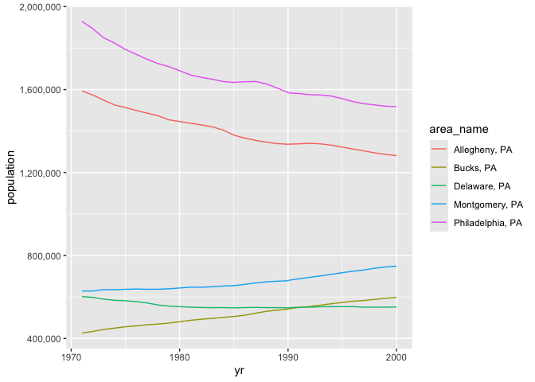

Project_1
================
Brian Higginbotham

- [1 Data](#1-data)
- [2 Data Processing](#data-processing)
- [3 Summarizing](#3-summarizing)
- [4 Put It Together](#put-it-together)

# 1 Data

The data files used in this project are from the Census Bureau:

- <https://www4.stat.ncsu.edu/~online/datasets/EDU01a.csv>  
- <https://www4.stat.ncsu.edu/~online/datasets/EDU01b.csv>  
- <https://www4.stat.ncsu.edu/~online/datasets/PST01a.csv>  
- <https://www4.stat.ncsu.edu/~online/datasets/PST01b.csv>  
- <https://www4.stat.ncsu.edu/~online/datasets/PST01c.csv>  
- <https://www4.stat.ncsu.edu/~online/datasets/PST01d.csv>

Read in appropriate packages:

``` r
library(tidyverse)
library(readr)
```

# 2 Data Processing

## 2.1 First Steps

Read in first data sheet (EDU01a)

``` r
library(readr)
sheet1 <- read_csv("https://www4.stat.ncsu.edu/~online/datasets/EDU01a.csv")
sheet1
```

    ## # A tibble: 3,198 × 42
    ##    Area_name     STCOU EDU010187F EDU010187D EDU010187N1 EDU010187N2 EDU010188F
    ##    <chr>         <chr>      <dbl>      <dbl> <chr>       <chr>            <dbl>
    ##  1 UNITED STATES 00000          0   40024299 0000        0000                 0
    ##  2 ALABAMA       01000          0     733735 0000        0000                 0
    ##  3 Autauga, AL   01001          0       6829 0000        0000                 0
    ##  4 Baldwin, AL   01003          0      16417 0000        0000                 0
    ##  5 Barbour, AL   01005          0       5071 0000        0000                 0
    ##  6 Bibb, AL      01007          0       3557 0000        0000                 0
    ##  7 Blount, AL    01009          0       7319 0000        0000                 0
    ##  8 Bullock, AL   01011          0       2014 0000        0000                 0
    ##  9 Butler, AL    01013          0       4640 0000        0000                 0
    ## 10 Calhoun, AL   01015          0      20939 0000        0000                 0
    ## # ℹ 3,188 more rows
    ## # ℹ 35 more variables: EDU010188D <dbl>, EDU010188N1 <chr>, EDU010188N2 <chr>,
    ## #   EDU010189F <dbl>, EDU010189D <dbl>, EDU010189N1 <chr>, EDU010189N2 <chr>,
    ## #   EDU010190F <dbl>, EDU010190D <dbl>, EDU010190N1 <chr>, EDU010190N2 <chr>,
    ## #   EDU010191F <dbl>, EDU010191D <dbl>, EDU010191N1 <chr>, EDU010191N2 <chr>,
    ## #   EDU010192F <dbl>, EDU010192D <dbl>, EDU010192N1 <chr>, EDU010192N2 <chr>,
    ## #   EDU010193F <dbl>, EDU010193D <dbl>, EDU010193N1 <chr>, EDU010193N2 <chr>, …

<br> Select columns (Area_name as area_name, STCOU, any column ending in
“D”)

``` r
sheet1 <- sheet1 %>% 
  select(Area_name, STCOU, ends_with("D")) %>%
  rename("area_name" = Area_name)
sheet1
```

    ## # A tibble: 3,198 × 12
    ##    area_name     STCOU EDU010187D EDU010188D EDU010189D EDU010190D EDU010191D
    ##    <chr>         <chr>      <dbl>      <dbl>      <dbl>      <dbl>      <dbl>
    ##  1 UNITED STATES 00000   40024299   39967624   40317775   40737600   41385442
    ##  2 ALABAMA       01000     733735     728234     730048     728252     725541
    ##  3 Autauga, AL   01001       6829       6900       6920       6847       7008
    ##  4 Baldwin, AL   01003      16417      16465      16799      17054      17479
    ##  5 Barbour, AL   01005       5071       5098       5068       5156       5173
    ##  6 Bibb, AL      01007       3557       3508       3571       3621       3652
    ##  7 Blount, AL    01009       7319       7223       7205       7209       7155
    ##  8 Bullock, AL   01011       2014       1980       1985       1983       1985
    ##  9 Butler, AL    01013       4640       4582       4610       4591       4544
    ## 10 Calhoun, AL   01015      20939      20923      20907      20849      20768
    ## # ℹ 3,188 more rows
    ## # ℹ 5 more variables: EDU010192D <dbl>, EDU010193D <dbl>, EDU010194D <dbl>,
    ## #   EDU010195D <dbl>, EDU010196D <dbl>

<br> Convert to long format

``` r
sheet1 <- sheet1 %>%
  pivot_longer(cols=3:12, names_to="edu", values_to = "enrollment")
sheet1
```

    ## # A tibble: 31,980 × 4
    ##    area_name     STCOU edu        enrollment
    ##    <chr>         <chr> <chr>           <dbl>
    ##  1 UNITED STATES 00000 EDU010187D   40024299
    ##  2 UNITED STATES 00000 EDU010188D   39967624
    ##  3 UNITED STATES 00000 EDU010189D   40317775
    ##  4 UNITED STATES 00000 EDU010190D   40737600
    ##  5 UNITED STATES 00000 EDU010191D   41385442
    ##  6 UNITED STATES 00000 EDU010192D   42088151
    ##  7 UNITED STATES 00000 EDU010193D   42724710
    ##  8 UNITED STATES 00000 EDU010194D   43369917
    ##  9 UNITED STATES 00000 EDU010195D   43993459
    ## 10 UNITED STATES 00000 EDU010196D   44715737
    ## # ℹ 31,970 more rows

<br> Parse the new column “edu” to pull out the year and convert to YYYY
format Grab the first 7 characters of the new column “edu”

``` r
# In the first step we drop the "D" from the "edu" column and then split the resulting column into two new columns - "edu" overwritten to now contain the first three characters and four digits of the old "edu" column, and "yr" which contains the last two digits of the year for the enrollment value
sheet1 <- sheet1 %>%
  mutate(edu=substr(sheet1$edu, 1, 9)) %>%
  separate(edu, into=c("edu_code", "yr"), sep=7, remove = TRUE, convert = FALSE)
# In the second step, we evaluate if the new column "yr" is greater than 50. If so, we paste0 "19" to it's value and force the value to be read as numeric; if the column value is less than 50, we paste "20" to the value and force the value to be read as numeric. 
sheet1 <- sheet1 %>%
  mutate(yr = if_else(sheet1$yr > 50, as.numeric(paste0("19", sheet1$yr, sep="")), as.numeric(paste0("20", sheet1$yr, sep=""))))
sheet1
```

    ## # A tibble: 31,980 × 5
    ##    area_name     STCOU edu_code    yr enrollment
    ##    <chr>         <chr> <chr>    <dbl>      <dbl>
    ##  1 UNITED STATES 00000 EDU0101   1987   40024299
    ##  2 UNITED STATES 00000 EDU0101   1988   39967624
    ##  3 UNITED STATES 00000 EDU0101   1989   40317775
    ##  4 UNITED STATES 00000 EDU0101   1990   40737600
    ##  5 UNITED STATES 00000 EDU0101   1991   41385442
    ##  6 UNITED STATES 00000 EDU0101   1992   42088151
    ##  7 UNITED STATES 00000 EDU0101   1993   42724710
    ##  8 UNITED STATES 00000 EDU0101   1994   43369917
    ##  9 UNITED STATES 00000 EDU0101   1995   43993459
    ## 10 UNITED STATES 00000 EDU0101   1996   44715737
    ## # ℹ 31,970 more rows

<br> Create two data sets:

- `county` containing only the county-level rows  
- `state` containing the non-county level rows

Add appropriate `class` to each

``` r
county_df <- sheet1[grep(pattern = ", \\w\\w", sheet1$area_name), ]
state_df <- sheet1[-c(grep(patter = ", \\w\\w", sheet1$area_name)), ]
class(county_df) <- c("county", class(county_df))
class(state_df) <- c("state", class(state_df))
county_df
```

    ## # A tibble: 31,450 × 5
    ##    area_name   STCOU edu_code    yr enrollment
    ##    <chr>       <chr> <chr>    <dbl>      <dbl>
    ##  1 Autauga, AL 01001 EDU0101   1987       6829
    ##  2 Autauga, AL 01001 EDU0101   1988       6900
    ##  3 Autauga, AL 01001 EDU0101   1989       6920
    ##  4 Autauga, AL 01001 EDU0101   1990       6847
    ##  5 Autauga, AL 01001 EDU0101   1991       7008
    ##  6 Autauga, AL 01001 EDU0101   1992       7137
    ##  7 Autauga, AL 01001 EDU0101   1993       7152
    ##  8 Autauga, AL 01001 EDU0101   1994       7381
    ##  9 Autauga, AL 01001 EDU0101   1995       7568
    ## 10 Autauga, AL 01001 EDU0101   1996       7834
    ## # ℹ 31,440 more rows

``` r
state_df
```

    ## # A tibble: 530 × 5
    ##    area_name     STCOU edu_code    yr enrollment
    ##    <chr>         <chr> <chr>    <dbl>      <dbl>
    ##  1 UNITED STATES 00000 EDU0101   1987   40024299
    ##  2 UNITED STATES 00000 EDU0101   1988   39967624
    ##  3 UNITED STATES 00000 EDU0101   1989   40317775
    ##  4 UNITED STATES 00000 EDU0101   1990   40737600
    ##  5 UNITED STATES 00000 EDU0101   1991   41385442
    ##  6 UNITED STATES 00000 EDU0101   1992   42088151
    ##  7 UNITED STATES 00000 EDU0101   1993   42724710
    ##  8 UNITED STATES 00000 EDU0101   1994   43369917
    ##  9 UNITED STATES 00000 EDU0101   1995   43993459
    ## 10 UNITED STATES 00000 EDU0101   1996   44715737
    ## # ℹ 520 more rows

<br> Add column containing state information for the county-level tibble

``` r
county_df <- county_df %>%
  mutate("state" = substr(county_df$area_name, nchar(county_df$area_name)-1, nchar(county_df$area_name)))
county_df
```

    ## # A tibble: 31,450 × 6
    ##    area_name   STCOU edu_code    yr enrollment state
    ##    <chr>       <chr> <chr>    <dbl>      <dbl> <chr>
    ##  1 Autauga, AL 01001 EDU0101   1987       6829 AL   
    ##  2 Autauga, AL 01001 EDU0101   1988       6900 AL   
    ##  3 Autauga, AL 01001 EDU0101   1989       6920 AL   
    ##  4 Autauga, AL 01001 EDU0101   1990       6847 AL   
    ##  5 Autauga, AL 01001 EDU0101   1991       7008 AL   
    ##  6 Autauga, AL 01001 EDU0101   1992       7137 AL   
    ##  7 Autauga, AL 01001 EDU0101   1993       7152 AL   
    ##  8 Autauga, AL 01001 EDU0101   1994       7381 AL   
    ##  9 Autauga, AL 01001 EDU0101   1995       7568 AL   
    ## 10 Autauga, AL 01001 EDU0101   1996       7834 AL   
    ## # ℹ 31,440 more rows

<br> Add column to non-county tibble corresponding to the state’s
classification of division

``` r
# created a vector for each regional division containing the names of the states within the division
new_england <- c("CONNECTICUT", "MAINE", "MASSACHUSETTS", "NEW HAMPSHIRE", "RHODE ISLAND", "VERMONT")
mid_atlantic <- c("NEW JERSEY", "NEW YORK", "PENNSYLVANIA")
east_north_central <- c("ILLINOIS", "INDIANA", "MICHIGAN", "OHIO", "WISCONSIN")
west_north_central <- c("IOWA", "KANSAS", "MINNESOTA", "MISSOURI", "NEBRASKA", "NORTH DAKOTA", "SOUTH DAKOTA")
# included District of Columbia in the South Atlantic Division since both Maryland and Virginia are in this division
south_atlantic <- c("DELAWARE", "FLORIDA", "GEORGIA", "MARYLAND", "NORTH CAROLINA", "SOUTH CAROLINA", "VIRGINIA", "DISTRICT OF COLUMBIA", "WEST VIRGINIA", "District of Columbia")
east_south_central <- c("ALABAMA", "KENTUCKY", "MISSISSIPPI", "TENNESSEE")
west_south_central <- c("ARKANSAS", "LOUISIANA", "OKLAHOMA", "TEXAS")
mountain <- c("ARIZONA", "COLORADO", "IDAHO", "MONTANA", "NEVADA", "NEW MEXICO", "UTAH", "WYOMING")
pacific <- c("ALASKA", "CALIFORNIA", "HAWAII", "OREGON", "WASHINGTON")
# created division column using if/else logic
state_df <- state_df %>%
  mutate("division" = if_else(area_name %in% new_england, "New England", 
          if_else(area_name %in% mid_atlantic, "Mid Atlantic", 
          if_else(area_name %in% east_north_central, "East North Central", 
          if_else(area_name %in% west_north_central, "West North Central", 
          if_else(area_name %in% south_atlantic, "South Atlantic", 
          if_else(area_name %in% east_south_central, "East South Central", 
          if_else(area_name %in% west_south_central, "West South Central", 
          if_else(area_name %in% mountain, "Mountain", 
          if_else(area_name %in% pacific, "Pacific", "ERROR"))))))))))
state_df
```

    ## # A tibble: 530 × 6
    ##    area_name     STCOU edu_code    yr enrollment division
    ##    <chr>         <chr> <chr>    <dbl>      <dbl> <chr>   
    ##  1 UNITED STATES 00000 EDU0101   1987   40024299 ERROR   
    ##  2 UNITED STATES 00000 EDU0101   1988   39967624 ERROR   
    ##  3 UNITED STATES 00000 EDU0101   1989   40317775 ERROR   
    ##  4 UNITED STATES 00000 EDU0101   1990   40737600 ERROR   
    ##  5 UNITED STATES 00000 EDU0101   1991   41385442 ERROR   
    ##  6 UNITED STATES 00000 EDU0101   1992   42088151 ERROR   
    ##  7 UNITED STATES 00000 EDU0101   1993   42724710 ERROR   
    ##  8 UNITED STATES 00000 EDU0101   1994   43369917 ERROR   
    ##  9 UNITED STATES 00000 EDU0101   1995   43993459 ERROR   
    ## 10 UNITED STATES 00000 EDU0101   1996   44715737 ERROR   
    ## # ℹ 520 more rows

## 2.2 Write Functions

Read in second data sheet (EDU01b)

``` r
sheet2 <- read_csv("https://www4.stat.ncsu.edu/~online/datasets/EDU01b.csv")
```

<br> Write a function to select/rename columns and pivot to long format

``` r
# included option argument to name column with enrollment data
select_and_pivot <- function(sheet, var_name = "population") {
  df <- sheet %>%
            select(Area_name, STCOU, ends_with("D")) %>%
            rename("area_name" = Area_name) %>%
            pivot_longer(cols=3:12, names_to="edu", values_to = var_name)
  return(df)
}
census <- select_and_pivot(sheet2, var_name = "enroll")
census
```

    ## # A tibble: 31,980 × 4
    ##    area_name     STCOU edu          enroll
    ##    <chr>         <chr> <chr>         <dbl>
    ##  1 UNITED STATES 00000 EDU010197D 44534459
    ##  2 UNITED STATES 00000 EDU010198D 46245814
    ##  3 UNITED STATES 00000 EDU010199D 46368903
    ##  4 UNITED STATES 00000 EDU010200D 46818690
    ##  5 UNITED STATES 00000 EDU010201D 47127066
    ##  6 UNITED STATES 00000 EDU010202D 47606570
    ##  7 UNITED STATES 00000 EDU015203D 48506317
    ##  8 UNITED STATES 00000 EDU015204D 48693287
    ##  9 UNITED STATES 00000 EDU015205D 48978555
    ## 10 UNITED STATES 00000 EDU015206D 49140702
    ## # ℹ 31,970 more rows

<br> Write a function that takes the output from `select_and_pivot()`
and creates a *year* column and a census description column (*edu_code*)

``` r
create_edu_yr <- function(sheet) {
  dfa <- sheet %>% 
           mutate(edu=substr(sheet$edu, 1, 9)) %>%
           separate(edu, into=c("edu_code", "yr"), sep=7, remove = TRUE, convert = FALSE)
  dfb <- dfa %>%
           mutate(yr = if_else(dfa$yr > 50, as.numeric(paste0("19", dfa$yr, sep="")), as.numeric(paste0("20", dfa$yr, sep=""))))
  return(dfb)
}
census <- create_edu_yr(census)
census
```

    ## # A tibble: 31,980 × 5
    ##    area_name     STCOU edu_code    yr   enroll
    ##    <chr>         <chr> <chr>    <dbl>    <dbl>
    ##  1 UNITED STATES 00000 EDU0101   1997 44534459
    ##  2 UNITED STATES 00000 EDU0101   1998 46245814
    ##  3 UNITED STATES 00000 EDU0101   1999 46368903
    ##  4 UNITED STATES 00000 EDU0102   2000 46818690
    ##  5 UNITED STATES 00000 EDU0102   2001 47127066
    ##  6 UNITED STATES 00000 EDU0102   2002 47606570
    ##  7 UNITED STATES 00000 EDU0152   2003 48506317
    ##  8 UNITED STATES 00000 EDU0152   2004 48693287
    ##  9 UNITED STATES 00000 EDU0152   2005 48978555
    ## 10 UNITED STATES 00000 EDU0152   2006 49140702
    ## # ℹ 31,970 more rows

<br> Write a function that will add a state information column (*state*)
to the county-level tibble

``` r
create_state <- function(sheet) {
  df <- sheet %>%
    mutate("state" = substr(sheet$area_name, nchar(sheet$area_name)-1, nchar(sheet$area_name)))
  return(df)
}
```

Write a function that will add a division classification column
(*division*) to the non-county tibble

``` r
create_division <- function(sheet) {
  df <- sheet %>%
    mutate("division" = if_else(area_name %in% new_england, "New England", 
            if_else(area_name %in% mid_atlantic, "Mid Atlantic", 
            if_else(area_name %in% east_north_central, "East North Central", 
            if_else(area_name %in% west_north_central, "West North Central", 
            if_else(area_name %in% south_atlantic, "South Atlantic", 
            if_else(area_name %in% east_south_central, "East South Central", 
            if_else(area_name %in% west_south_central, "West South Central", 
            if_else(area_name %in% mountain, "Mountain", 
            if_else(area_name %in% pacific, "Pacific", "ERROR"))))))))))
  return(df)
}
```

<br> Write a function that takes the output from `create_edu_yr()` and
creates two tibbes - one for county rows and another for non-county
rows. Add *state* column to county tibble and add *division
classification* to non-county tibble. **Return one object with two
tibbles**

``` r
split_county_state <- function(sheet) {
  county <- sheet[grep(pattern = ", \\w\\w", sheet$area_name), ]
  class(county) <- c("county", class(county))
  county <- create_state(county)
  state <- sheet[-c(grep(patter = ", \\w\\w", sheet$area_name)), ]
  class(state) <- c("state", class(state))
  state <- create_division(state)
  return(list(county = county, state = state))
}
census <- split_county_state(census)
census$county
```

    ## # A tibble: 31,450 × 6
    ##    area_name   STCOU edu_code    yr enroll state
    ##    <chr>       <chr> <chr>    <dbl>  <dbl> <chr>
    ##  1 Autauga, AL 01001 EDU0101   1997   8099 AL   
    ##  2 Autauga, AL 01001 EDU0101   1998   8211 AL   
    ##  3 Autauga, AL 01001 EDU0101   1999   8489 AL   
    ##  4 Autauga, AL 01001 EDU0102   2000   8912 AL   
    ##  5 Autauga, AL 01001 EDU0102   2001   8626 AL   
    ##  6 Autauga, AL 01001 EDU0102   2002   8762 AL   
    ##  7 Autauga, AL 01001 EDU0152   2003   9105 AL   
    ##  8 Autauga, AL 01001 EDU0152   2004   9200 AL   
    ##  9 Autauga, AL 01001 EDU0152   2005   9559 AL   
    ## 10 Autauga, AL 01001 EDU0152   2006   9652 AL   
    ## # ℹ 31,440 more rows

``` r
census$state
```

    ## # A tibble: 530 × 6
    ##    area_name     STCOU edu_code    yr   enroll division
    ##    <chr>         <chr> <chr>    <dbl>    <dbl> <chr>   
    ##  1 UNITED STATES 00000 EDU0101   1997 44534459 ERROR   
    ##  2 UNITED STATES 00000 EDU0101   1998 46245814 ERROR   
    ##  3 UNITED STATES 00000 EDU0101   1999 46368903 ERROR   
    ##  4 UNITED STATES 00000 EDU0102   2000 46818690 ERROR   
    ##  5 UNITED STATES 00000 EDU0102   2001 47127066 ERROR   
    ##  6 UNITED STATES 00000 EDU0102   2002 47606570 ERROR   
    ##  7 UNITED STATES 00000 EDU0152   2003 48506317 ERROR   
    ##  8 UNITED STATES 00000 EDU0152   2004 48693287 ERROR   
    ##  9 UNITED STATES 00000 EDU0152   2005 48978555 ERROR   
    ## 10 UNITED STATES 00000 EDU0152   2006 49140702 ERROR   
    ## # ℹ 520 more rows

<br> Write a `wrapper function` that will take in a URL address to one
CSV file and return two tibbles in a single object

``` r
process_data <- function(url, var_name = "population") {
  a <- read_csv(url)
  b <- select_and_pivot(a, var_name)
  c <- create_edu_yr(b)
  d <- split_county_state(c)
  return(d)
}
```

## 2.3 Call It & Combine

Call the wrapper function twice, once for each census file (EDU01a &
EDU01b)

``` r
edu_01a <- process_data("https://www4.stat.ncsu.edu/~online/datasets/EDU01a.csv", var_name = "pop")
edu_01a
```

    ## $county
    ## # A tibble: 31,450 × 6
    ##    area_name   STCOU edu_code    yr   pop state
    ##    <chr>       <chr> <chr>    <dbl> <dbl> <chr>
    ##  1 Autauga, AL 01001 EDU0101   1987  6829 AL   
    ##  2 Autauga, AL 01001 EDU0101   1988  6900 AL   
    ##  3 Autauga, AL 01001 EDU0101   1989  6920 AL   
    ##  4 Autauga, AL 01001 EDU0101   1990  6847 AL   
    ##  5 Autauga, AL 01001 EDU0101   1991  7008 AL   
    ##  6 Autauga, AL 01001 EDU0101   1992  7137 AL   
    ##  7 Autauga, AL 01001 EDU0101   1993  7152 AL   
    ##  8 Autauga, AL 01001 EDU0101   1994  7381 AL   
    ##  9 Autauga, AL 01001 EDU0101   1995  7568 AL   
    ## 10 Autauga, AL 01001 EDU0101   1996  7834 AL   
    ## # ℹ 31,440 more rows
    ## 
    ## $state
    ## # A tibble: 530 × 6
    ##    area_name     STCOU edu_code    yr      pop division
    ##    <chr>         <chr> <chr>    <dbl>    <dbl> <chr>   
    ##  1 UNITED STATES 00000 EDU0101   1987 40024299 ERROR   
    ##  2 UNITED STATES 00000 EDU0101   1988 39967624 ERROR   
    ##  3 UNITED STATES 00000 EDU0101   1989 40317775 ERROR   
    ##  4 UNITED STATES 00000 EDU0101   1990 40737600 ERROR   
    ##  5 UNITED STATES 00000 EDU0101   1991 41385442 ERROR   
    ##  6 UNITED STATES 00000 EDU0101   1992 42088151 ERROR   
    ##  7 UNITED STATES 00000 EDU0101   1993 42724710 ERROR   
    ##  8 UNITED STATES 00000 EDU0101   1994 43369917 ERROR   
    ##  9 UNITED STATES 00000 EDU0101   1995 43993459 ERROR   
    ## 10 UNITED STATES 00000 EDU0101   1996 44715737 ERROR   
    ## # ℹ 520 more rows

``` r
edu_01b <- process_data("https://www4.stat.ncsu.edu/~online/datasets/EDU01b.csv", var_name = "pop")
edu_01b
```

    ## $county
    ## # A tibble: 31,450 × 6
    ##    area_name   STCOU edu_code    yr   pop state
    ##    <chr>       <chr> <chr>    <dbl> <dbl> <chr>
    ##  1 Autauga, AL 01001 EDU0101   1997  8099 AL   
    ##  2 Autauga, AL 01001 EDU0101   1998  8211 AL   
    ##  3 Autauga, AL 01001 EDU0101   1999  8489 AL   
    ##  4 Autauga, AL 01001 EDU0102   2000  8912 AL   
    ##  5 Autauga, AL 01001 EDU0102   2001  8626 AL   
    ##  6 Autauga, AL 01001 EDU0102   2002  8762 AL   
    ##  7 Autauga, AL 01001 EDU0152   2003  9105 AL   
    ##  8 Autauga, AL 01001 EDU0152   2004  9200 AL   
    ##  9 Autauga, AL 01001 EDU0152   2005  9559 AL   
    ## 10 Autauga, AL 01001 EDU0152   2006  9652 AL   
    ## # ℹ 31,440 more rows
    ## 
    ## $state
    ## # A tibble: 530 × 6
    ##    area_name     STCOU edu_code    yr      pop division
    ##    <chr>         <chr> <chr>    <dbl>    <dbl> <chr>   
    ##  1 UNITED STATES 00000 EDU0101   1997 44534459 ERROR   
    ##  2 UNITED STATES 00000 EDU0101   1998 46245814 ERROR   
    ##  3 UNITED STATES 00000 EDU0101   1999 46368903 ERROR   
    ##  4 UNITED STATES 00000 EDU0102   2000 46818690 ERROR   
    ##  5 UNITED STATES 00000 EDU0102   2001 47127066 ERROR   
    ##  6 UNITED STATES 00000 EDU0102   2002 47606570 ERROR   
    ##  7 UNITED STATES 00000 EDU0152   2003 48506317 ERROR   
    ##  8 UNITED STATES 00000 EDU0152   2004 48693287 ERROR   
    ##  9 UNITED STATES 00000 EDU0152   2005 48978555 ERROR   
    ## 10 UNITED STATES 00000 EDU0152   2006 49140702 ERROR   
    ## # ℹ 520 more rows

<br> Write a function to combine the county and non-county tibbles of
the above outputs

``` r
combine_data <- function(data_1, data_2) {
  a <- bind_rows(data_1$county, data_2$county)
  b <- bind_rows(data_1$state, data_2$state)
  return(list(county = a,state = b))
}
```

<br> Call combine function

``` r
edu_01 <- combine_data(edu_01a, edu_01b)
edu_01$county
```

    ## # A tibble: 62,900 × 6
    ##    area_name   STCOU edu_code    yr   pop state
    ##    <chr>       <chr> <chr>    <dbl> <dbl> <chr>
    ##  1 Autauga, AL 01001 EDU0101   1987  6829 AL   
    ##  2 Autauga, AL 01001 EDU0101   1988  6900 AL   
    ##  3 Autauga, AL 01001 EDU0101   1989  6920 AL   
    ##  4 Autauga, AL 01001 EDU0101   1990  6847 AL   
    ##  5 Autauga, AL 01001 EDU0101   1991  7008 AL   
    ##  6 Autauga, AL 01001 EDU0101   1992  7137 AL   
    ##  7 Autauga, AL 01001 EDU0101   1993  7152 AL   
    ##  8 Autauga, AL 01001 EDU0101   1994  7381 AL   
    ##  9 Autauga, AL 01001 EDU0101   1995  7568 AL   
    ## 10 Autauga, AL 01001 EDU0101   1996  7834 AL   
    ## # ℹ 62,890 more rows

``` r
edu_01$state
```

    ## # A tibble: 1,060 × 6
    ##    area_name     STCOU edu_code    yr      pop division
    ##    <chr>         <chr> <chr>    <dbl>    <dbl> <chr>   
    ##  1 UNITED STATES 00000 EDU0101   1987 40024299 ERROR   
    ##  2 UNITED STATES 00000 EDU0101   1988 39967624 ERROR   
    ##  3 UNITED STATES 00000 EDU0101   1989 40317775 ERROR   
    ##  4 UNITED STATES 00000 EDU0101   1990 40737600 ERROR   
    ##  5 UNITED STATES 00000 EDU0101   1991 41385442 ERROR   
    ##  6 UNITED STATES 00000 EDU0101   1992 42088151 ERROR   
    ##  7 UNITED STATES 00000 EDU0101   1993 42724710 ERROR   
    ##  8 UNITED STATES 00000 EDU0101   1994 43369917 ERROR   
    ##  9 UNITED STATES 00000 EDU0101   1995 43993459 ERROR   
    ## 10 UNITED STATES 00000 EDU0101   1996 44715737 ERROR   
    ## # ℹ 1,050 more rows

# 3 Summarizing

`state` plotting method:

``` r
# calculates the mean of the var_name (population) by regional division and year
# filters out all rows were division == "ERROR"
plot.state <- function(df, var_name = "population") {
  new_df <- df %>%
    group_by(division, yr) %>% 
    summarise(ENRmean = mean(get(var_name))) %>%
    filter(division != "ERROR")
  
# plots a line graph of the mean var_name (population) by year for each regional division
  ggplot(new_df, aes(x = yr, y = ENRmean, color = division)) + 
    geom_line() + scale_y_continuous(labels = scales::comma) + ylab(var_name)
}
```

<br> `county` plotting method

``` r
# order defaults to "top", so if order argument is left blank or if "top" is entered, the function will return dataframe in descending order. If "bottom" is entered for the argument, the dataframe will return in ascending order. If anything other than "top" or "bottom" is entered, the function will STOP and request user to enter appropriate argument
plot.county <- function(df, var_name = "population", st = "IL", order = "top", n = 5) {
  if(order == "top"){
  new_df <- df %>%
    filter(state == st) %>%
    group_by(area_name) %>%
    summarise(ENRmean = mean(get(var_name))) %>%
    arrange(desc(ENRmean))
  }
  else if(order == "bottom"){
    new_df <- df %>%
      filter(state == st) %>%
      group_by(area_name) %>%
      summarise(ENRmean = mean(get(var_name))) %>%
      arrange(ENRmean)
  }
  else{
    stop("Specify Order (top or bottom)")
  }
# the above function returns the highest or lowest means of var_name (population) grouped by county for the state entered in the argument.
# the below function filters the original input dataframe based on the area_names of the above results, so that the new dataframe (filter_df) contains non-aggregated data for the counties identified in the above results
  new_df <- new_df[1:n, ]
  filter_df <- df %>%
    filter(area_name %in% new_df$area_name)
  
# plots a line graph of the var_name (population) for each year for the top or bottom 'n' counties for the state entered in the function argument  
  ggplot(filter_df, aes(x = yr, y = get(var_name), color = area_name)) +
    geom_line() + scale_y_continuous(labels = scales::comma) + ylab(var_name)
}
```

# 4 Put It Together

## 4.1 EDU URLs

Run the data processing function on the two EDU URLs

``` r
edu_01a <- process_data("https://www4.stat.ncsu.edu/~online/datasets/EDU01a.csv", var_name = "pop")
edu_01b <- process_data("https://www4.stat.ncsu.edu/~online/datasets/EDU01b.csv", var_name = "pop")
```

<br> Combine function

``` r
edu_01 <- combine_data(edu_01a, edu_01b)
```

<br> Plot `state` dataframe

``` r
plot(edu_01$state, var_name = "pop")
```

<!-- --> <br> Plot `county`
dataframe - North Carolina

``` r
plot(edu_01$county, "pop", "NC", "top", 10)
```

<!-- --> <br> Plot `county`
dataframe - Arizona

``` r
plot(edu_01$county, "pop", "AZ", "bottom", 6)
```

<!-- --> <br> Plot `county`
dataframe - defaults

``` r
# Have to specify var_name since the plotting default ("population") would not match data source ("pop")
plot(edu_01$county, "pop")
```

<!-- --> <br> Plot
`county` dataframe - Ohio

``` r
plot(edu_01$county, "pop", "OH", "top", 8)
```

<!-- -->

## 4.2 PST URLs

Run the data processing function on the four PST URLs

``` r
pst_01a <- process_data("https://www4.stat.ncsu.edu/~online/datasets/PST01a.csv")
pst_01b <- process_data("https://www4.stat.ncsu.edu/~online/datasets/PST01b.csv")
pst_01c <- process_data("https://www4.stat.ncsu.edu/~online/datasets/PST01c.csv")
pst_01d <- process_data("https://www4.stat.ncsu.edu/~online/datasets/PST01a.csv")
```

<br> Combine function

``` r
pst_01 <- combine_data(pst_01a, pst_01b)
pst_01 <- combine_data(pst_01c, pst_01)
pst_01 <- combine_data(pst_01d, pst_01)
```

<br> Plot `state` dataframe

``` r
plot(pst_01$state)
```

<!-- --> <br> Plot
`county` dataframe - Pennsylvania

``` r
plot(pst_01$county,,"PA",, 5)
```

<!-- --> <br> Plot `county`
dataframe - Texas

``` r
plot(pst_01$county,,"TX","bottom", 12)
```

<!-- --> <br> Plot `county`
dataframe - default

``` r
plot(pst_01$county)
```

<!-- --> <br> Plot
`county` dataframe - New York

``` r
plot(pst_01$county,,"NY",, 6)
```

<!-- -->
